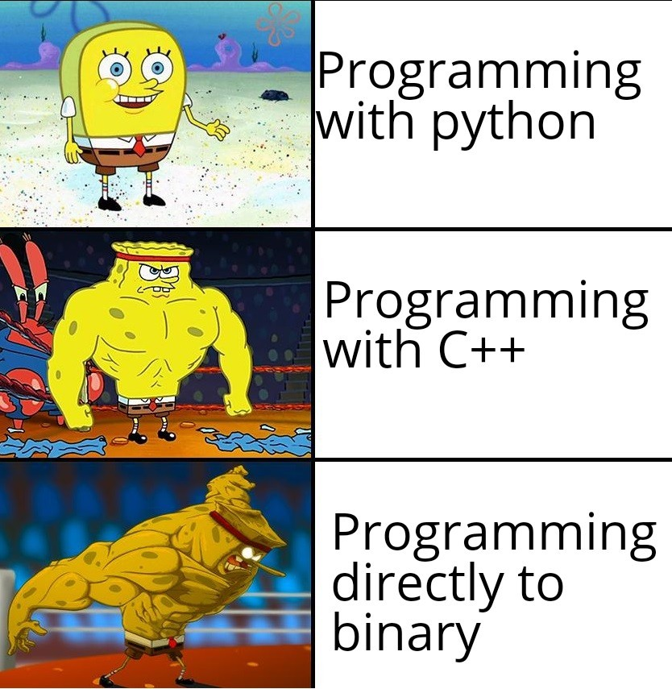

<div align="center">
  <p>
    
  </p>
  <h1><strong> &#127775 Cpp_Toolkits &#127775 </strong></h1>
  <p>
    <strong> &#128293; All in one cpp toolkits. &#128293;</strong>
  </p>
  <p>
    
  </p>
</div>

# Table of contents
- [Install Guide](#install-guide)
- [Design Draft](#design-draft)
- [Features](#features)
    
## Install Guide
**OS REQUIRED**: Debian

```bash
$ make # build the project
$ make package # build debian package
$ make install # install directories and cmake 
```


## Design Draft


## Features


### TODO
- [ ] Traits Module
- [ ] Static Check
- [ ] Valgrind
